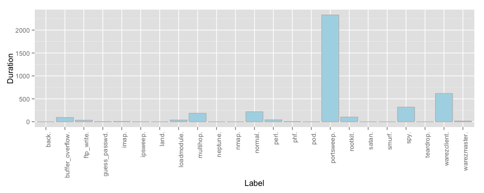

# KDD Cup 99 - H2O and R
Jose A. Dianes  
6 April 2015  

My try with [KDD Cup 99](http://kdd.ics.uci.edu/databases/kddcup99/task.html) 
using [H2O](http://0xdata.com/) and `R`. The dataset for this data mining 
competition can be found 
[here](http://kdd.ics.uci.edu/databases/kddcup99/kddcup99.html).  

## Task description summary  

You can find the complete description of the task 
[here](http://kdd.ics.uci.edu/databases/kddcup99/task.html).  

Software to detect network intrusions protects a computer network from
unauthorized users, including perhaps insiders.  The intrusion detector learning
task is to build a predictive model (i.e. a classifier) capable of
distinguishing between *bad connections*, called intrusions or attacks, and
*good normal connections*.  

A connection is a sequence of TCP packets starting and ending at some well
defined times, between which data flows to and from a source IP address to a
target IP address under some well defined protocol.  Each connection is labeled
as either normal, or as an attack, with exactly one specific attack type.  Each
connection record consists of about 100 bytes.  

Attacks fall into four main categories:  

- DOS: denial-of-service, e.g. syn flood;  
- R2L: unauthorized access from a remote machine, e.g. guessing password;  
- U2R:  unauthorized access to local superuser (root) privileges, e.g., various
``buffer overflow'' attacks;  
- probing: surveillance and other probing, e.g., port scanning.  

It is important to note that the test data is not from the same probability
distribution as the training data, and it includes specific attack types not in
the training data. This makes the task more realistic. The datasets contain a
total of 24 training attack types, with an additional 14 types in the test data
only.   

Some intrusion experts believe that most novel attacks are variants of known
attacks and the "signature" of known attacks can be sufficient to catch novel
variants. Based on this idea, we will experiment with different machine learning
approaches.   

# Connecting to H2O cluster  

First we need to set the connection settings.  


```r
library(h2o)
h2o_ip <- '169.254.206.2'
h2o_port <- 54321
```

Now we can connect to our cluster.  


```r
jupiterH2O <- h2o.init(ip = h2o_ip, port=h2o_port)
```

```
## Successfully connected to http://169.254.206.2:54321 
## 
## R is connected to H2O cluster:
##     H2O cluster uptime:         57 minutes 46 seconds 
##     H2O cluster version:        2.9.0.1752 
##     H2O cluster name:           cluster 
##     H2O cluster total nodes:    8 
##     H2O cluster total memory:   28.45 GB 
##     H2O cluster total cores:    16 
##     H2O cluster allowed cores:  16 
##     H2O cluster healthy:        TRUE
```

# Reading data 

Now we are ready to read our data files. We have it stored in the 
cluster's NFS structure. In H2O, we assign logical names to those data files 
that we read into memory (e.g. `key_data_name`). In our case:  

- **`kdd_data.hex`**: contains the training data.  
- **`kdd_corrected.hex`**: contains the labeled data that will be used 
for testing purposes.  


```r
key_name_data <- "kdd_data.hex"
system.time(
    kdd_data.hex <- h2o.importFile(
        jupiterH2O, 
        path = "/nfs/data/KDD99/kddcup.data", 
        key = key_name_data)
)
```

```
## 
  |                                                                       
  |                                                                 |   0%
  |                                                                       
  |=====================================                            |  58%
  |                                                                       
  |==============================================================   |  96%
  |                                                                       
  |=================================================================| 100%
```

```
##    user  system elapsed 
##   0.114   0.011   3.696
```

```r
train_size <- nrow(kdd_data.hex)
```

We also need to read the test data by following the same process.  


```r
key_name_corrected <- "kdd_corrected.hex"
system.time(
    kdd_corrected.hex <- h2o.importFile(
        jupiterH2O, 
        path = "/nfs/data/KDD99/corrected", 
        key = key_name_corrected)
)
```

```
## 
  |                                                                       
  |                                                                 |   0%
  |                                                                       
  |=================================================================| 100%
```

```
##    user  system elapsed 
##   0.082   0.008   1.425
```

```r
test_size <- nrow(kdd_corrected.hex)
```

Notice how, once we have the data in memory, they are represented as data frames 
and we can check their sizes using for example `nrow`. For the train data we 
have 4.898431\times 10^{6} entries. For test data we have 3.11029\times 10^{5}.  

Finally we can sumarise as we do with regular data frames.  


```r
summary(kdd_data.hex)
```

```
##  C1                 C2            C3                C4           
##  Min.   :    0.00   icmp:2833545  ecr_i   :2811660  SF  :3744328 
##  1st Qu.:   14.65   tcp :1870598  private :1100831  S0  : 869829 
##  Median :   29.29   udp : 194288  http    : 623091  REJ : 268874 
##  Mean   :   48.34                 smtp    :  96554  RSTR:   8094 
##  3rd Qu.:   43.94                 other   :  72653  RSTO:   5344 
##  Max.   :58329.00                 domain_u:  57782  SH  :   1040 
##  C5                  C6                  C7                 
##  Min.   :0.000e+00   Min.   :0.000e+00   Min.   :0.000e+00  
##  1st Qu.:3.027e+05   1st Qu.:3.268e+05   1st Qu.:0.000e+00  
##  Median :6.054e+05   Median :6.537e+05   Median :0.000e+00  
##  Mean   :1.835e+03   Mean   :1.094e+03   Mean   :5.716e-06  
##  3rd Qu.:9.081e+05   3rd Qu.:9.805e+05   3rd Qu.:0.000e+00  
##  Max.   :1.380e+09   Max.   :1.310e+09   Max.   :1.000e+00  
##  C8                  C9                  C10               
##  Min.   :0.0000000   Min.   :0.000e+00   Min.   : 0.00000  
##  1st Qu.:0.0000000   1st Qu.:0.000e+00   1st Qu.: 0.00000  
##  Median :0.0000000   Median :0.000e+00   Median : 0.00000  
##  Mean   :0.0006488   Mean   :7.962e-06   Mean   : 0.01244  
##  3rd Qu.:0.0000000   3rd Qu.:0.000e+00   3rd Qu.: 0.00000  
##  Max.   :3.0000000   Max.   :1.400e+01   Max.   :77.00000  
##  C11                 C12              C13                
##  Min.   :0.000e+00   Min.   :0.0000   Min.   :0.000e+00  
##  1st Qu.:0.000e+00   1st Qu.:0.0000   1st Qu.:1.750e+00  
##  Median :0.000e+00   Median :0.0000   Median :3.500e+00  
##  Mean   :3.205e-05   Mean   :0.1435   Mean   :8.088e-03  
##  3rd Qu.:0.000e+00   3rd Qu.:0.0000   3rd Qu.:5.250e+00  
##  Max.   :5.000e+00   Max.   :1.0000   Max.   :7.479e+03  
##  C14                 C15                 C16                
##  Min.   :0.000e+00   Min.   :0.000e+00   Min.   :0.000e+00  
##  1st Qu.:0.000e+00   1st Qu.:0.000e+00   1st Qu.:1.751e+00  
##  Median :0.000e+00   Median :0.000e+00   Median :3.501e+00  
##  Mean   :6.819e-05   Mean   :3.675e-05   Mean   :1.293e-02  
##  3rd Qu.:0.000e+00   3rd Qu.:0.000e+00   3rd Qu.:5.252e+00  
##  Max.   :1.000e+00   Max.   :2.000e+00   Max.   :7.468e+03  
##  C17                 C18                 C19                C20        
##  Min.   : 0.000000   Min.   :0.000e+00   Min.   :0.000000   Min.   :0  
##  1st Qu.: 0.000000   1st Qu.:0.000e+00   1st Qu.:0.000000   1st Qu.:0  
##  Median : 0.000000   Median :0.000e+00   Median :0.000000   Median :0  
##  Mean   : 0.001189   Mean   :7.431e-05   Mean   :0.001021   Mean   :0  
##  3rd Qu.: 0.000000   3rd Qu.:0.000e+00   3rd Qu.:0.000000   3rd Qu.:0  
##  Max.   :43.000000   Max.   :2.000e+00   Max.   :9.000000   Max.   :0  
##  C21                 C22                 C23           C24            
##  Min.   :0.000e+00   Min.   :0.0000000   Min.   :  0   Min.   :  0.0  
##  1st Qu.:0.000e+00   1st Qu.:0.0000000   1st Qu.:121   1st Qu.: 10.0  
##  Median :0.000e+00   Median :0.0000000   Median :510   Median :510.0  
##  Mean   :4.083e-07   Mean   :0.0008352   Mean   :335   Mean   :295.3  
##  3rd Qu.:0.000e+00   3rd Qu.:0.0000000   3rd Qu.:511   3rd Qu.:511.0  
##  Max.   :1.000e+00   Max.   :1.0000000   Max.   :511   Max.   :511.0  
##  C25             C26             C27               C28              
##  Min.   :0.000   Min.   :0.000   Min.   :0.00000   Min.   :0.00000  
##  1st Qu.:0.000   1st Qu.:0.000   1st Qu.:0.00000   1st Qu.:0.00000  
##  Median :0.000   Median :0.000   Median :0.00000   Median :0.00000  
##  Mean   :0.178   Mean   :0.178   Mean   :0.05767   Mean   :0.05773  
##  3rd Qu.:0.000   3rd Qu.:0.000   3rd Qu.:0.00000   3rd Qu.:0.00000  
##  Max.   :1.000   Max.   :1.000   Max.   :1.00000   Max.   :1.00000  
##  C29              C30               C31               C32          
##  Min.   :0.0000   Min.   :0.00000   Min.   :0.00000   Min.   :  0  
##  1st Qu.:1.0000   1st Qu.:0.00000   1st Qu.:0.00000   1st Qu.:255  
##  Median :1.0000   Median :0.00000   Median :0.00000   Median :255  
##  Mean   :0.7899   Mean   :0.02118   Mean   :0.02826   Mean   :233  
##  3rd Qu.:1.0000   3rd Qu.:0.00000   3rd Qu.:0.00000   3rd Qu.:255  
##  Max.   :1.0000   Max.   :1.00000   Max.   :1.00000   Max.   :255  
##  C33             C34              C35               C36             
##  Min.   :  0.0   Min.   :0.0000   Min.   :0.00000   Min.   :0.0000  
##  1st Qu.: 49.0   1st Qu.:0.4100   1st Qu.:0.00000   1st Qu.:0.0000  
##  Median :255.0   Median :1.0000   Median :0.00000   Median :1.0000  
##  Mean   :189.2   Mean   :0.7537   Mean   :0.03071   Mean   :0.6051  
##  3rd Qu.:255.0   3rd Qu.:1.0000   3rd Qu.:0.04000   3rd Qu.:1.0000  
##  Max.   :255.0   Max.   :1.0000   Max.   :1.00000   Max.   :1.0000  
##  C37                C38              C39              C40              
##  Min.   :0.000000   Min.   :0.0000   Min.   :0.0000   Min.   :0.00000  
##  1st Qu.:0.000000   1st Qu.:0.0000   1st Qu.:0.0000   1st Qu.:0.00000  
##  Median :0.000000   Median :0.0000   Median :0.0000   Median :0.00000  
##  Mean   :0.006464   Mean   :0.1781   Mean   :0.1779   Mean   :0.05793  
##  3rd Qu.:0.000000   3rd Qu.:0.0000   3rd Qu.:0.0000   3rd Qu.:0.00000  
##  Max.   :1.000000   Max.   :1.0000   Max.   :1.0000   Max.   :1.00000  
##  C41               C42                
##  Min.   :0.00000   smurf.    :2807886 
##  1st Qu.:0.00000   neptune.  :1072017 
##  Median :0.00000   normal.   : 972781 
##  Mean   :0.05766   satan.    :  15892 
##  3rd Qu.:0.00000   ipsweep.  :  12481 
##  Max.   :1.00000   portsweep.:  10413
```

# Data exploration  

The good thing about using `H2O` from R is that we have access to the usual way
of exploring data with R. We just need to use the way of applying functions 
proposed by `H2O`.  

For example, let's install a function to take the mean of the duration column.  


```r
duration_mean <- function(df) { mean(df[,1]) }
h2o.addFunction(jupiterH2O, duration_mean)
```

Now we can apply the function to different label groups by using `ddply`, that
works with `H2O` `hex` objects.    


```r
res <- h2o.ddply(kdd_data.hex, "C42", duration_mean)
by_label_means <- as.data.frame(head(res,23))

# h2o seems to be inconsistent when labeling factor results
label_names <- levels(kdd_data.hex[,42])
if (!is.factor(by_label_means$C42)) {
    by_label_means$C42 <- as.factor(label_names[by_label_means$C42+1])
}
```

Now we can plot using `ggplot`.  


```r
library(ggplot2)
ggplot(data=by_label_means, aes(x=C42, y=C1)) +
    geom_bar(stat="identity", color="grey", fill="lightblue") +
    xlab("Label") +
    theme(axis.text.x = element_text(angle = 90, hjust = 1)) + 
    ylab("Duration")
```

 

