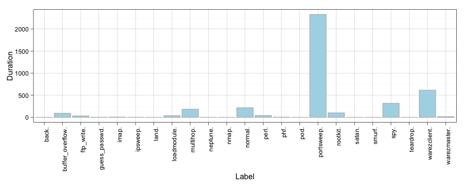
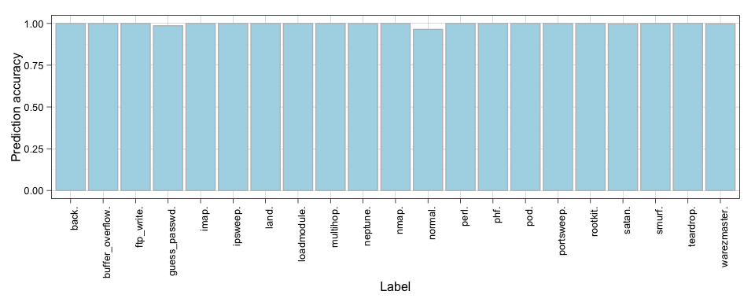

# KDD Cup 99 - H2O and R
Jose A. Dianes  
6 April 2015  

My try with [KDD Cup 99](http://kdd.ics.uci.edu/databases/kddcup99/task.html) 
using [H2O](http://0xdata.com/) and `R`. The dataset for this data mining 
competition can be found 
[here](http://kdd.ics.uci.edu/databases/kddcup99/kddcup99.html).  

## Task description summary  

You can find the complete description of the task 
[here](http://kdd.ics.uci.edu/databases/kddcup99/task.html).  

Software to detect network intrusions protects a computer network from
unauthorized users, including perhaps insiders.  The intrusion detector learning
task is to build a predictive model (i.e. a classifier) capable of
distinguishing between *bad connections*, called intrusions or attacks, and
*good normal connections*.  

A connection is a sequence of TCP packets starting and ending at some well
defined times, between which data flows to and from a source IP address to a
target IP address under some well defined protocol.  Each connection is labeled
as either normal, or as an attack, with exactly one specific attack type.  Each
connection record consists of about 100 bytes.  

Attacks fall into four main categories:  

- DOS: denial-of-service, e.g. syn flood;  
- R2L: unauthorized access from a remote machine, e.g. guessing password;  
- U2R:  unauthorized access to local superuser (root) privileges, e.g., various
``buffer overflow'' attacks;  
- probing: surveillance and other probing, e.g., port scanning.  

It is important to note that the test data is not from the same probability
distribution as the training data, and it includes specific attack types not in
the training data. This makes the task more realistic. The datasets contain a
total of 24 training attack types, with an additional 14 types in the test data
only.   

Some intrusion experts believe that most novel attacks are variants of known
attacks and the "signature" of known attacks can be sufficient to catch novel
variants. Based on this idea, we will experiment with different machine learning
approaches.   

## Approach

We will start by loading the data and do some exploratory data analysis using.
Then we will build a classifier using `H2O` *random forest* implementation.  

However, in our final approach we want to use clustering and anomality
detection. We want our model to be able to work well with unknown attack types
and also to give an approchimation of the closest attack type.   

## Libraries and global settings used  


```r
library(ggplot2)
theme_set(theme_linedraw())
library(pander)
library(h2o)
```

## Connecting to H2O cluster  

First we need to set the connection settings.  


```r
h2o_ip <- '169.254.206.2'
h2o_port <- 54321
```

Now we can connect to our cluster.  


```r
jupiterH2O <- h2o.init(ip = h2o_ip, port=h2o_port)
```

```
## Successfully connected to http://169.254.206.2:54321 
## 
## R is connected to H2O cluster:
##     H2O cluster uptime:         1 hours 29 minutes 
##     H2O cluster version:        2.9.0.1752 
##     H2O cluster name:           cluster 
##     H2O cluster total nodes:    8 
##     H2O cluster total memory:   28.45 GB 
##     H2O cluster total cores:    16 
##     H2O cluster allowed cores:  16 
##     H2O cluster healthy:        TRUE
```

## Reading data 

Now we are ready to read our data files. We have it stored in the 
cluster's NFS structure. In H2O, we assign logical names to those data files 
that we read into memory (e.g. `key_data_name`). In our case:  

- **`kdd_data.hex`**: contains the training data.  
- **`kdd_corrected.hex`**: contains the labeled data that will be used 
for testing purposes.  


```r
key_name_data <- "kdd_data.hex"
system.time(
    kdd_data.hex <- h2o.importFile(
        jupiterH2O, 
        path = "/nfs/data/KDD99/kddcup.data", 
        key = key_name_data)
)
```

```
## 
  |                                                                       
  |                                                                 |   0%
  |                                                                       
  |============================================                     |  68%
  |                                                                       
  |=================================================================|  99%
  |                                                                       
  |=================================================================| 100%
```

```
##    user  system elapsed 
##   0.185   0.098   4.814
```

```r
train_size <- nrow(kdd_data.hex)
```

We also need to read the test data by following the same process.  


```r
key_name_corrected <- "kdd_corrected.hex"
system.time(
    kdd_corrected.hex <- h2o.importFile(
        jupiterH2O, 
        path = "/nfs/data/KDD99/corrected", 
        key = key_name_corrected)
)
```

```
## 
  |                                                                       
  |                                                                 |   0%
  |                                                                       
  |=================================================================| 100%
```

```
##    user  system elapsed 
##   0.101   0.031   1.549
```

```r
test_size <- nrow(kdd_corrected.hex)
```

Notice how, once we have the data in memory, they are represented as data frames 
and we can check their sizes using for example `nrow`. For the train data we 
have 4.898431\times 10^{6} entries. For test data we have 3.11029\times 10^{5}.  

Finally we can sumarise as we do with regular data frames.  


```r
summary(kdd_data.hex)
```

```
##  C1                 C2            C3                C4           
##  Min.   :    0.00   icmp:2833545  ecr_i   :2811660  SF  :3744328 
##  1st Qu.:   14.65   tcp :1870598  private :1100831  S0  : 869829 
##  Median :   29.29   udp : 194288  http    : 623091  REJ : 268874 
##  Mean   :   48.34                 smtp    :  96554  RSTR:   8094 
##  3rd Qu.:   43.94                 other   :  72653  RSTO:   5344 
##  Max.   :58329.00                 domain_u:  57782  SH  :   1040 
##  C5                  C6                  C7                 
##  Min.   :0.000e+00   Min.   :0.000e+00   Min.   :0.000e+00  
##  1st Qu.:3.027e+05   1st Qu.:3.268e+05   1st Qu.:0.000e+00  
##  Median :6.054e+05   Median :6.537e+05   Median :0.000e+00  
##  Mean   :1.835e+03   Mean   :1.094e+03   Mean   :5.716e-06  
##  3rd Qu.:9.081e+05   3rd Qu.:9.805e+05   3rd Qu.:0.000e+00  
##  Max.   :1.380e+09   Max.   :1.310e+09   Max.   :1.000e+00  
##  C8                  C9                  C10               
##  Min.   :0.0000000   Min.   :0.000e+00   Min.   : 0.00000  
##  1st Qu.:0.0000000   1st Qu.:0.000e+00   1st Qu.: 0.00000  
##  Median :0.0000000   Median :0.000e+00   Median : 0.00000  
##  Mean   :0.0006488   Mean   :7.962e-06   Mean   : 0.01244  
##  3rd Qu.:0.0000000   3rd Qu.:0.000e+00   3rd Qu.: 0.00000  
##  Max.   :3.0000000   Max.   :1.400e+01   Max.   :77.00000  
##  C11                 C12              C13                
##  Min.   :0.000e+00   Min.   :0.0000   Min.   :0.000e+00  
##  1st Qu.:0.000e+00   1st Qu.:0.0000   1st Qu.:1.750e+00  
##  Median :0.000e+00   Median :0.0000   Median :3.500e+00  
##  Mean   :3.205e-05   Mean   :0.1435   Mean   :8.088e-03  
##  3rd Qu.:0.000e+00   3rd Qu.:0.0000   3rd Qu.:5.250e+00  
##  Max.   :5.000e+00   Max.   :1.0000   Max.   :7.479e+03  
##  C14                 C15                 C16                
##  Min.   :0.000e+00   Min.   :0.000e+00   Min.   :0.000e+00  
##  1st Qu.:0.000e+00   1st Qu.:0.000e+00   1st Qu.:1.751e+00  
##  Median :0.000e+00   Median :0.000e+00   Median :3.501e+00  
##  Mean   :6.819e-05   Mean   :3.675e-05   Mean   :1.293e-02  
##  3rd Qu.:0.000e+00   3rd Qu.:0.000e+00   3rd Qu.:5.252e+00  
##  Max.   :1.000e+00   Max.   :2.000e+00   Max.   :7.468e+03  
##  C17                 C18                 C19                C20        
##  Min.   : 0.000000   Min.   :0.000e+00   Min.   :0.000000   Min.   :0  
##  1st Qu.: 0.000000   1st Qu.:0.000e+00   1st Qu.:0.000000   1st Qu.:0  
##  Median : 0.000000   Median :0.000e+00   Median :0.000000   Median :0  
##  Mean   : 0.001189   Mean   :7.431e-05   Mean   :0.001021   Mean   :0  
##  3rd Qu.: 0.000000   3rd Qu.:0.000e+00   3rd Qu.:0.000000   3rd Qu.:0  
##  Max.   :43.000000   Max.   :2.000e+00   Max.   :9.000000   Max.   :0  
##  C21                 C22                 C23           C24            
##  Min.   :0.000e+00   Min.   :0.0000000   Min.   :  0   Min.   :  0.0  
##  1st Qu.:0.000e+00   1st Qu.:0.0000000   1st Qu.:121   1st Qu.: 10.0  
##  Median :0.000e+00   Median :0.0000000   Median :510   Median :510.0  
##  Mean   :4.083e-07   Mean   :0.0008352   Mean   :335   Mean   :295.3  
##  3rd Qu.:0.000e+00   3rd Qu.:0.0000000   3rd Qu.:511   3rd Qu.:511.0  
##  Max.   :1.000e+00   Max.   :1.0000000   Max.   :511   Max.   :511.0  
##  C25             C26             C27               C28              
##  Min.   :0.000   Min.   :0.000   Min.   :0.00000   Min.   :0.00000  
##  1st Qu.:0.000   1st Qu.:0.000   1st Qu.:0.00000   1st Qu.:0.00000  
##  Median :0.000   Median :0.000   Median :0.00000   Median :0.00000  
##  Mean   :0.178   Mean   :0.178   Mean   :0.05767   Mean   :0.05773  
##  3rd Qu.:0.000   3rd Qu.:0.000   3rd Qu.:0.00000   3rd Qu.:0.00000  
##  Max.   :1.000   Max.   :1.000   Max.   :1.00000   Max.   :1.00000  
##  C29              C30               C31               C32          
##  Min.   :0.0000   Min.   :0.00000   Min.   :0.00000   Min.   :  0  
##  1st Qu.:1.0000   1st Qu.:0.00000   1st Qu.:0.00000   1st Qu.:255  
##  Median :1.0000   Median :0.00000   Median :0.00000   Median :255  
##  Mean   :0.7899   Mean   :0.02118   Mean   :0.02826   Mean   :233  
##  3rd Qu.:1.0000   3rd Qu.:0.00000   3rd Qu.:0.00000   3rd Qu.:255  
##  Max.   :1.0000   Max.   :1.00000   Max.   :1.00000   Max.   :255  
##  C33             C34              C35               C36             
##  Min.   :  0.0   Min.   :0.0000   Min.   :0.00000   Min.   :0.0000  
##  1st Qu.: 49.0   1st Qu.:0.4100   1st Qu.:0.00000   1st Qu.:0.0000  
##  Median :255.0   Median :1.0000   Median :0.00000   Median :1.0000  
##  Mean   :189.2   Mean   :0.7537   Mean   :0.03071   Mean   :0.6051  
##  3rd Qu.:255.0   3rd Qu.:1.0000   3rd Qu.:0.04000   3rd Qu.:1.0000  
##  Max.   :255.0   Max.   :1.0000   Max.   :1.00000   Max.   :1.0000  
##  C37                C38              C39              C40              
##  Min.   :0.000000   Min.   :0.0000   Min.   :0.0000   Min.   :0.00000  
##  1st Qu.:0.000000   1st Qu.:0.0000   1st Qu.:0.0000   1st Qu.:0.00000  
##  Median :0.000000   Median :0.0000   Median :0.0000   Median :0.00000  
##  Mean   :0.006464   Mean   :0.1781   Mean   :0.1779   Mean   :0.05793  
##  3rd Qu.:0.000000   3rd Qu.:0.0000   3rd Qu.:0.0000   3rd Qu.:0.00000  
##  Max.   :1.000000   Max.   :1.0000   Max.   :1.0000   Max.   :1.00000  
##  C41               C42                
##  Min.   :0.00000   smurf.    :2807886 
##  1st Qu.:0.00000   neptune.  :1072017 
##  Median :0.00000   normal.   : 972781 
##  Mean   :0.05766   satan.    :  15892 
##  3rd Qu.:0.00000   ipsweep.  :  12481 
##  Max.   :1.00000   portsweep.:  10413
```

## Data exploration  

The good thing about using `H2O` from R is that we have access to the usual way
of exploring data with R. We just need to use the way of applying functions 
proposed by `H2O`.  

For example, let's install a function to take the mean of the duration column.  


```r
duration_mean <- function(df) { mean(df[,1]) }
h2o.addFunction(jupiterH2O, duration_mean)
```

Now we can apply the function to different label groups by using `ddply`, that
works with `H2O` `hex` objects.    


```r
res <- h2o.ddply(kdd_data.hex, "C42", duration_mean)
by_label_means <- as.data.frame(head(res,23))

# h2o seems to be inconsistent when labeling factor results
label_names <- levels(kdd_data.hex[,42])
if (!is.factor(by_label_means$C42)) {
    by_label_means$C42 <- as.factor(label_names[by_label_means$C42+1])
}
```

Now we can plot using `ggplot`. Let's see the mean duration by label.    


```r
ggplot(data=by_label_means, aes(x=C42, y=C1)) +
    geom_bar(stat="identity", color="grey", fill="lightblue") +
    xlab("Label") +
    theme(axis.text.x = element_text(angle = 90, hjust = 1)) + 
    ylab("Duration")
```

 

## Training a classifier  

The `H2O` framework offers a rich machine learning library. In this case we will
train a *random forest* classifier. We will try with every single predictor.  


```r
system.time(
    kdd_data.rf <- h2o.randomForest(y = 42, x = c(1:41), data = kdd_data.hex, 
                                ntree = 100, depth = 500)
)
```

```
## 
  |                                                                       
  |                                                                 |   0%
  |                                                                       
  |=                                                                |   1%
  |                                                                       
  |=====                                                            |   7%
  |                                                                       
  |=========                                                        |  14%
  |                                                                       
  |============                                                     |  19%
  |                                                                       
  |================                                                 |  24%
  |                                                                       
  |=================                                                |  26%
  |                                                                       
  |===================                                              |  29%
  |                                                                       
  |===========================                                      |  42%
  |                                                                       
  |====================================                             |  56%
  |                                                                       
  |====================================================             |  80%
  |                                                                       
  |==========================================================       |  90%
  |                                                                       
  |================================================================ |  98%
  |                                                                       
  |=================================================================| 100%
```

```
##    user  system elapsed 
##   1.845   1.392  54.500
```

We have just trained a *random forest* for more than 4 million entries of data 
and 41 predictors.  

We can print the resulting tree object.  


```r
print(kdd_data.rf)
```

```
## IP Address: 169.254.206.2 
## Port      : 54321 
## Parsed Data Key: kdd_data.hex 
## 
## Random Forest Model Key: SpeeDRF_aacef8174a494b578a2ec75056d34bcb
## 
## Seed Used:  3939147678132500480
## 
## Classification: TRUE
## Number of trees: 100
## Confusion matrix:
## Reported on training data.                  Predicted
## Actual             back. buffer_overflow. ftp_write. guess_passwd. imap.
##   back.             2203                0          0             0     0
##   buffer_overflow.     0               29          0             0     0
##   ftp_write.           0                0          8             0     0
##   guess_passwd.        0                0          0            53     0
##   imap.                0                0          0             0    12
##   ipsweep.             0                0          0             0     0
##   land.                0                0          0             0     0
##   loadmodule.          0                0          0             0     0
##   multihop.            0                0          0             0     0
##   neptune.             0                0          0             0     0
##   nmap.                0                0          0             0     0
##   normal.              0                0          0             0     0
##   perl.                0                0          0             0     0
##   phf.                 0                0          0             0     0
##   pod.                 0                0          0             0     0
##   portsweep.           0                0          0             0     0
##   rootkit.             0                0          0             0     0
##   satan.               0                0          0             0     0
##   smurf.               0                0          0             0     0
##   spy.                 0                0          0             0     0
##   teardrop.            0                0          0             0     0
##   warezclient.         0                0          0             0     0
##   warezmaster.         0                0          0             0     0
##   Totals            2203               29          8            53    12
##                   Predicted
## Actual             ipsweep. land. loadmodule. multihop. neptune. nmap.
##   back.                   0     0           0         0        0     0
##   buffer_overflow.        0     0           0         0        0     0
##   ftp_write.              0     0           0         0        0     0
##   guess_passwd.           0     0           0         0        0     0
##   imap.                   0     0           0         0        0     0
##   ipsweep.            12477     0           0         0        0     2
##   land.                   0    20           0         0        0     0
##   loadmodule.             0     0           8         0        0     0
##   multihop.               0     0           0         7        0     0
##   neptune.                0     0           0         0  1072017     0
##   nmap.                   7     0           0         0        0  2309
##   normal.                 0     5           0         0        0     0
##   perl.                   0     0           0         0        0     0
##   phf.                    0     0           0         0        0     0
##   pod.                    0     0           0         0        0     0
##   portsweep.              2     0           0         0        0     0
##   rootkit.                0     0           0         0        0     0
##   satan.                  0     0           0         0        0     0
##   smurf.                  0     0           0         0        0     0
##   spy.                    0     0           0         0        0     0
##   teardrop.               0     0           0         0        0     0
##   warezclient.            0     0           0         0        0     0
##   warezmaster.            0     0           0         0        0     0
##   Totals              12486    25           8         7  1072017  2311
##                   Predicted
## Actual             normal. perl. phf. pod. portsweep. rootkit. satan.
##   back.                  0     0    0    0          0        0      0
##   buffer_overflow.       1     0    0    0          0        0      0
##   ftp_write.             0     0    0    0          0        0      0
##   guess_passwd.          0     0    0    0          0        0      0
##   imap.                  0     0    0    0          0        0      0
##   ipsweep.               0     0    0    0          0        0      2
##   land.                  1     0    0    0          0        0      0
##   loadmodule.            1     0    0    0          0        0      0
##   multihop.              0     0    0    0          0        0      0
##   neptune.               0     0    0    0          0        0      0
##   nmap.                  0     0    0    0          0        0      0
##   normal.           972771     0    0    2          0        1      2
##   perl.                  0     3    0    0          0        0      0
##   phf.                   0     0    4    0          0        0      0
##   pod.                   1     0    0  263          0        0      0
##   portsweep.             0     0    0    0      10411        0      0
##   rootkit.               4     0    0    0          0        6      0
##   satan.                 5     0    0    0          0        0  15887
##   smurf.              7100     0    0    0          0        0      0
##   spy.                   0     0    0    0          0        0      0
##   teardrop.              0     0    0    0          0        0      0
##   warezclient.           3     0    0    0          0        0      0
##   warezmaster.           0     0    0    0          0        0      0
##   Totals            979887     3    4  265      10411        7  15891
##                   Predicted
## Actual              smurf. spy. teardrop. warezclient. warezmaster.
##   back.                  0    0         0            0            0
##   buffer_overflow.       0    0         0            0            0
##   ftp_write.             0    0         0            0            0
##   guess_passwd.          0    0         0            0            0
##   imap.                  0    0         0            0            0
##   ipsweep.               0    0         0            0            0
##   land.                  0    0         0            0            0
##   loadmodule.            0    0         0            0            0
##   multihop.              0    0         0            0            0
##   neptune.               0    0         0            0            0
##   nmap.                  0    0         0            0            0
##   normal.                0    0         0            0            0
##   perl.                  0    0         0            0            0
##   phf.                   0    0         0            0            0
##   pod.                   0    0         0            0            0
##   portsweep.             0    0         0            0            0
##   rootkit.               0    0         0            0            0
##   satan.                 0    0         0            0            0
##   smurf.           2800786    0         0            0            0
##   spy.                   0    2         0            0            0
##   teardrop.              0    0       979            0            0
##   warezclient.           0    0         0         1017            0
##   warezmaster.           0    0         0            0           20
##   Totals           2800786    2       979         1017           20
##                   Predicted
## Actual               Error
##   back.            0.00000
##   buffer_overflow. 0.03333
##   ftp_write.       0.00000
##   guess_passwd.    0.00000
##   imap.            0.00000
##   ipsweep.         0.00032
##   land.            0.04762
##   loadmodule.      0.11111
##   multihop.        0.00000
##   neptune.         0.00000
##   nmap.            0.00302
##   normal.          0.00001
##   perl.            0.00000
##   phf.             0.00000
##   pod.             0.00379
##   portsweep.       0.00019
##   rootkit.         0.40000
##   satan.           0.00031
##   smurf.           0.00253
##   spy.             0.00000
##   teardrop.        0.00000
##   warezclient.     0.00294
##   warezmaster.     0.00000
##   Totals           0.00146
## 
## Mean-squared Error from the 100 trees: 0.01372278
```


###  Predicting labels using testing data  


```r
kdd_data.rf.pred <- h2o.predict(kdd_data.rf, newdata=kdd_corrected.hex)
head(kdd_data.rf.pred)
```

```
##   predict back. buffer_overflow. ftp_write. guess_passwd. imap. ipsweep.
## 1 normal.     0                0          0             0     0        0
## 2 normal.     0                0          0             0     0        0
## 3 normal.     0                0          0             0     0        0
## 4 normal.     0                0          0             0     0        0
## 5 normal.     0                0          0             0     0        0
## 6 normal.     0                0          0             0     0        0
##   land. loadmodule. multihop. neptune. nmap. normal. perl. phf. pod.
## 1     0           0         0        0     0       1     0    0    0
## 2     0           0         0        0     0       1     0    0    0
## 3     0           0         0        0     0       1     0    0    0
## 4     0           0         0        0     0       1     0    0    0
## 5     0           0         0        0     0       1     0    0    0
## 6     0           0         0        0     0       1     0    0    0
##   portsweep. rootkit. satan. smurf. spy. teardrop. warezclient.
## 1          0        0      0      0    0         0            0
## 2          0        0      0      0    0         0            0
## 3          0        0      0      0    0         0            0
## 4          0        0      0      0    0         0            0
## 5          0        0      0      0    0         0            0
## 6          0        0      0      0    0         0            0
##   warezmaster.
## 1            0
## 2            0
## 3            0
## 4            0
## 5            0
## 6            0
```

Get accuracy (h2o result gives problems with colums 20 and 22, don't know why...).  


```r
accuracies <- sapply(
    c(1:19,21,23), 
    function(x) {  h2o.performance(kdd_data.rf.pred[,x+1], kdd_corrected.hex$C42==label_names[x])@model$accuracy }
    )
accuracy <- mean(accuracies)
```

Plot accuracies.  


```r
accuracies.df <- data.frame(label=label_names[c(1:19,21,23)], accuracy=accuracies)
ggplot(data=accuracies.df, aes(x=label, y=accuracy)) +
    geom_bar(stat="identity", color="grey", fill="lightblue") +
    xlab("Label") +
    theme(axis.text.x = element_text(angle = 90, hjust = 1)) + 
    ylab("Prediction accuracy")
```

 


## Clustering data  

Clustering by using *k-means* is as easy as use the corresponsing part of the 
`H2O` library for `R`.  

We will cluster for `k = 40` (at least we have 23 different labels in our 
dataset). Of course we don't use the label to cluster the data. Moreover k-means
just works with numeric data, we can't use some predictors like they are such as
`protocol`, `service`, or `flag`.  


```r
system.time(
    kdd_data.km <- h2o.kmeans(
        data = kdd_data.hex, 
        centers = 40, 
        cols = c(1,5:41), 
        normalize=T,
        iter.max=10)
)
```

```
## 
  |                                                                       
  |                                                                 |   0%
  |                                                                       
  |======                                                           |  10%
  |                                                                       
  |=============                                                    |  20%
  |                                                                       
  |====================                                             |  30%
  |                                                                       
  |==========================                                       |  40%
  |                                                                       
  |================================                                 |  50%
  |                                                                       
  |=======================================                          |  60%
  |                                                                       
  |==============================================                   |  70%
  |                                                                       
  |====================================================             |  80%
  |                                                                       
  |==========================================================       |  90%
  |                                                                       
  |=================================================================| 100%
```

```
##    user  system elapsed 
##   0.749   0.521  21.717
```

Sadly, the current *k-means* implementation doesn't return the cluster to data 
assignments. If we see the documentation it was there before, but we can't find it
in the version we used in this analysis.  

But we can print the contains of the resulting object.  


```r
kdd_data.km
```

```
## IP Address: 169.254.206.2 
## Port      : 54321 
## Parsed Data Key: kdd_data.hex 
## 
## K-Means Model Key: KMeans2_88ccab9f3530414e69d5facffd424a07
## 
## K-means clustering with 40 clusters of sizes 47453, 11542, 101237, 15780, 3880, 144468, 26517, 2630550, 9385, 18451, 9228, 4446, 118044, 40816, 59971, 43521, 6011, 788, 4667, 24050, 41062, 20382, 76394, 17658, 172548, 105462, 27821, 70884, 6448, 176345, 95215, 125856, 42781, 22593, 9798, 191750, 153512, 83045, 123829, 14243
## 
## Cluster means:
##               C1            C5           C6            C7            C8
## 1   6.276884e+00  1.229311e+04 7.176391e+03  1.228198e-19  9.649399e-18
## 2   2.685843e-03  1.408768e-01 1.139750e+00  9.063253e-20  5.312591e-18
## 3   4.593182e-03  1.058309e-01 8.692474e-03 -8.360215e-19  4.304283e-17
## 4   5.672370e-01  2.289949e+01 1.783016e+00  1.770299e-19 -3.155028e-17
## 5   5.034021e+00  7.733247e+01 1.695569e+03  7.216495e-03  6.179952e-18
## 6  -4.369838e-12  2.936983e-02 2.651106e-03  1.871943e-19 -6.841316e-17
## 7   2.415130e+00  2.545421e+03 4.589071e+02  5.929231e-20  2.262699e-04
## 8  -1.271871e-11  9.628703e+02 3.041210e-05 -3.958185e-18 -2.676895e-16
## 9   1.268005e+04  4.807685e+05 2.255504e+05  8.724439e-20  3.100693e-01
## 10  4.127473e+00  1.365483e+03 2.548913e+03  3.472835e-20  4.336809e-19
## 11  5.743390e-03  2.373819e+01 1.362245e+01  1.168905e-19  9.644560e-03
## 12  1.081633e+02  9.537368e+02 1.784485e+03 -8.470329e-21  0.000000e+00
## 13  4.269781e+00  5.729727e+02 3.132159e+02  1.778769e-19  5.591136e-04
## 14  4.957100e+00  7.563162e+01 1.230486e+01  1.702536e-19 -1.257675e-17
## 15  3.903387e-01  3.475306e+02 2.821996e+03  1.626303e-19  1.376937e-17
## 16  6.984444e-01  3.199673e+02 4.713005e+03  1.423015e-19  7.122998e-04
## 17  2.590251e+00  1.891590e+03 4.862568e+03  8.470329e-22  8.318084e-04
## 18  2.767900e+03  3.594123e+03 2.411329e+04  8.470329e-22 -1.084202e-19
## 19  1.765856e+02  1.021388e+03 6.680670e+03 -1.609363e-20 -3.252607e-19
## 20  3.878877e+00  1.507217e+03 1.437743e+03  5.166901e-20  1.084202e-18
## 21  8.280064e+00  9.752959e+03 5.233569e+03  1.050321e-19  6.818957e-04
## 22  3.865196e+02  2.685412e+03 4.903092e+02  8.470329e-20  6.830474e-18
## 23  5.156295e-01  5.226141e+02 4.628533e+03  1.626303e-19  1.496199e-17
## 24  2.378016e+00  1.826970e+03 4.720430e+03  5.166901e-20  1.698947e-03
## 25  9.244964e-01  6.717300e+02 4.020439e+03  1.880413e-19 -7.860466e-17
## 26  2.491959e+00  1.051336e+00 3.262094e+00 -6.852497e-19 -1.409463e-17
## 27  3.424751e-01  3.016574e+02 3.553816e+03  1.118083e-19  7.155734e-18
## 28  3.525055e-01  4.894360e+02 4.448284e+03  1.609363e-19  1.485357e-17
## 29  7.771790e+01  5.361507e+00 8.866625e+00  1.168905e-19  9.432559e-18
## 30  2.835350e-05  5.301375e+02 1.514078e-02 -3.453353e-18 -1.937469e-16
## 31 -7.581491e-12  1.523404e-10 1.400622e-10  1.846532e-19 -2.341877e-17
## 32 -3.304024e-12 -1.145963e-10 8.822099e-11  1.829591e-19 -4.380177e-17
## 33  2.417692e+03  1.019966e+03 2.766859e+02  1.744888e-19  3.038732e-04
## 34  1.991767e-03  1.459877e+00 2.615053e+01  8.724439e-20 -1.723881e-17
## 35  8.675240e-03  9.351092e+00 4.737395e+00  1.702536e-19 -1.110223e-16
## 36 -5.840661e-12  3.076922e-04 1.261924e-10  1.719477e-19 -6.689527e-17
## 37  2.520976e-03  2.892021e-01 2.401767e-02  1.871943e-19 -6.266689e-17
## 38  3.447528e-01  2.621332e+02 5.201362e+03  1.694066e-19 -5.963112e-18
## 39 -4.597212e-12  1.072447e-02 3.537136e-03  1.812651e-19 -4.044074e-17
## 40  1.823478e+01  1.786132e+04 5.998695e+03  1.948176e-20 -2.168404e-18
##               C9           C10           C11           C12           C13
## 1   2.107348e-05  7.860409e-03  7.386127e-19  1.000000e+00  1.983015e-02
## 2  -5.082198e-20  3.465604e-04  1.761829e-19  6.064807e-04  6.938894e-17
## 3  -1.643244e-19 -3.320261e-15  2.453007e-18  9.877811e-06  9.176687e-16
## 4   4.133521e-19  1.267427e-04  1.809262e-18  1.520913e-03 -5.290907e-16
## 5   7.731959e-04  1.546392e-03  1.288660e-03  9.716495e-02  1.597938e-02
## 6   5.370189e-19 -6.349088e-16  2.134523e-18  6.921948e-06 -9.089951e-16
## 7  -6.776264e-21  1.697025e-03  6.776264e-21  8.362183e-01  3.394049e-04
## 8  -4.933120e-18 -4.447831e-15  2.568204e-18  7.069345e-14  2.138914e-15
## 9  -5.759824e-20  2.237613e-03  1.065530e-04  2.695791e-02  1.523708e-02
## 10 -8.470329e-21  3.446968e-02  0.000000e+00  6.175817e-01  1.463335e-02
## 11  2.320870e-19  2.167317e-04  9.215718e-19  4.768097e-03 -1.578598e-16
## 12 -1.694066e-21  1.204656e+01  1.124606e-03  9.988754e-01  1.754386e-02
## 13  4.845028e-19  3.388567e-05  1.931235e-18 -9.936496e-15 -1.387779e-16
## 14  2.270048e-19  1.764014e-03  1.127009e-03  1.886515e-03  4.900039e-05
## 15  1.185846e-20  3.701789e-03  1.429792e-18  1.000000e+00  1.350653e-03
## 16 -1.202787e-19  4.825257e-03  9.961107e-19  9.938191e-01  7.582546e-04
## 17  1.355253e-20  5.323573e-03 -6.776264e-20  3.538513e-01  8.983530e-03
## 18  1.142132e-02  6.510152e-01  1.522843e-02  1.000000e+00  1.596447e+00
## 19  4.071138e-03  7.499464e-03  2.356975e-03  1.000000e+00  7.358689e+00
## 20 -3.388132e-21  5.613306e-03 -6.776264e-21  8.273181e-01  1.663202e-03
## 21  7.306025e-05  6.380595e-03  3.997996e-19  4.273051e-01  1.315085e-02
## 22 -1.135024e-19  1.471887e-03  4.906290e-05  2.327544e-01  2.011579e-03
## 23  1.592422e-19  5.550174e-03  1.565317e-18  1.000000e+00  1.701704e-03
## 24  4.912791e-20  1.812210e-02 -2.303930e-19  9.811983e-01  1.302526e-03
## 25  5.302426e-19  1.688226e-02  2.114194e-18  1.000000e+00  7.192202e-03
## 26 -2.947675e-19  1.801597e-04  2.398797e-18  5.120328e-04  7.285839e-16
## 27 -5.929231e-20  2.839582e-03  2.168404e-19  1.000000e+00  7.907696e-04
## 28  1.168905e-19  6.277862e-03  1.544988e-18  1.000000e+00  2.172564e-03
## 29 -1.118083e-19  3.101737e-04  6.572976e-19  2.016129e-03  6.203474e-04
## 30 -4.143685e-18 -4.230991e-15  2.480112e-18  6.411538e-14  1.963707e-15
## 31  5.963112e-19 -2.227385e-15  2.093865e-18 -4.801715e-15  3.122502e-17
## 32  4.031877e-19 -2.810252e-16  1.978669e-18 -1.007527e-14 -6.366435e-16
## 33  9.349945e-05  4.908721e-04  1.776490e-03  3.639466e-02  2.547860e-03
## 34  1.880413e-19  1.327845e-04  6.437450e-19  2.655690e-04 -2.445960e-16
## 35  5.793705e-19  7.144315e-04  2.059984e-18  3.061849e-04 -8.101159e-16
## 36  5.590417e-19 -1.316655e-15  2.209062e-18  5.215124e-06 -6.782769e-16
## 37  4.912791e-19 -6.054185e-16  2.080313e-18  9.771223e-05  5.862734e-05
## 38  2.676624e-19  2.938166e-03  1.694066e-18  9.997110e-01  8.429165e-05
## 39  4.218224e-19 -1.032160e-15  1.958340e-18  8.075653e-06 -2.896988e-16
## 40  5.421011e-20  2.000983e-02 -2.439455e-19  9.958576e-01  1.825458e-03
##              C14           C15           C16           C17           C18
## 1  -8.402567e-19 -8.131516e-19  2.620277e-01  1.508861e-02  1.328148e-18
## 2   5.014435e-19 -3.184844e-19 -6.418477e-17 -4.553649e-18  3.117081e-19
## 3  -1.173649e-17  7.386127e-18 -1.994932e-15  2.862294e-17  4.743385e-18
## 4  -7.006657e-18  1.341700e-18  2.534854e-04 -4.488597e-17  3.455894e-18
## 5   4.201283e-19 -5.488773e-19  7.216495e-03 -4.770490e-18  6.776264e-19
## 6  -8.890458e-18  3.028990e-18  2.151057e-16 -5.095750e-17  4.133521e-18
## 7   4.607859e-19 -8.809143e-20  4.246333e-02  8.560546e-03  1.761829e-19
## 8  -1.288845e-17  9.256376e-18 -2.935152e-15 -3.872770e-16  5.000883e-18
## 9   4.607859e-19 -3.726945e-19  9.909430e-03  5.327651e-04  3.117081e-19
## 10  4.336809e-19 -4.065758e-20  6.449515e-03  4.335808e-04  2.981556e-19
## 11 -3.577867e-18  3.794708e-19  6.314393e-16 -1.756408e-17  1.910906e-18
## 12  8.996851e-04  4.743385e-20  1.529465e-02  1.327036e-02  8.052182e-02
## 13 -8.104411e-18  3.964114e-18 -9.020562e-16  8.153200e-17  3.726945e-18
## 14 -4.973777e-18  0.000000e+00  2.758210e-16 -2.016616e-17  3.171291e-18
## 15 -2.290377e-18 -1.605974e-18  3.334945e-05  1.667473e-05  2.642743e-18
## 16 -2.032879e-19 -1.307819e-18  1.631396e-03  6.893224e-05  1.748276e-18
## 17  1.626303e-19  1.287490e-19  4.059225e-02  8.673617e-19 -6.776264e-20
## 18  3.324873e-01  2.411168e-02  1.667513e+00  5.032995e+00  5.076142e-03
## 19  1.457039e-02  3.449754e-02  7.930148e+00  9.856439e-03  4.285408e-04
## 20  4.472334e-19 -4.065758e-20  2.370062e-02  8.856549e-03  1.761829e-19
## 21 -1.355253e-19 -5.895349e-19  1.903220e-01  5.430812e-03  7.047314e-19
## 22  2.710505e-19 -7.386127e-19  6.020018e-02  2.305956e-03  1.111307e-18
## 23 -3.997996e-18 -1.768605e-18  3.403409e-04  1.479174e-03  2.940898e-18
## 24  4.336809e-19  1.965116e-19  5.266735e-03  1.585684e-03 -2.574980e-19
## 25 -8.836248e-18  3.347474e-18  2.318196e-05  1.564782e-04  4.052206e-18
## 26 -1.143833e-17  7.182839e-18 -1.866562e-15  3.924812e-17  4.662069e-18
## 27  5.421011e-19 -4.133521e-19  1.078322e-04  7.188814e-05  2.032879e-19
## 28 -3.564315e-18 -1.890578e-18  2.116133e-04  1.114497e-03  2.886688e-18
## 29  2.710505e-19 -8.741380e-19 -1.613293e-16 -6.288373e-18  1.084202e-18
## 30 -1.238701e-17  8.843024e-18 -2.784231e-15 -3.838076e-16  4.851805e-18
## 31 -9.473216e-18  5.326143e-18 -1.207368e-15  1.201296e-16  4.038653e-18
## 32 -7.291260e-18  1.741500e-18  3.105155e-16 -4.315125e-17  3.754050e-18
## 33 -7.291260e-18  2.100642e-18  1.975176e-02  4.674973e-04  3.550762e-18
## 34 -2.588533e-18  7.182839e-19  1.838807e-16 -1.994932e-17  1.490778e-18
## 35 -9.364796e-18  4.919567e-18 -8.135853e-16  3.100818e-17  3.970890e-18
## 36 -9.269929e-18  3.889575e-18 -4.371503e-16  4.770490e-18  4.269046e-18
## 37 -8.375462e-18  2.737610e-18  1.821460e-16 -5.551115e-17  3.997996e-18
## 38 -5.353248e-18 -1.287490e-19  6.020832e-05  1.204166e-05  3.198396e-18
## 39 -7.386127e-18  2.602085e-18 -4.475587e-16  3.447763e-17  3.713392e-18
## 40  4.201283e-19  2.778268e-19  1.720143e-02  2.738187e-03 -6.776264e-20
##              C19 C20           C21           C22        C23        C24
## 1  -1.951564e-18   0  4.288104e-21 -2.602085e-17   3.066571   3.051567
## 2  -6.071532e-18   0 -5.293956e-22 -1.821460e-17   1.033790   2.224484
## 3   1.732555e-16   0  9.635000e-21 -4.629543e-17 246.604611  10.555587
## 4  -6.505213e-18   0 -3.546950e-21 -3.968180e-17 430.823701   1.018378
## 5  -1.235990e-17   0  1.535247e-21 -1.929880e-17   1.044588   1.040722
## 6  -4.466913e-17   0  3.599890e-21 -4.271757e-17 270.079097  12.382673
## 7  -5.204170e-18   0 -1.323489e-21 -1.192622e-17   1.031979   2.601124
## 8   3.885781e-16   0 -5.272780e-20 -4.759648e-17 510.665716 510.663584
## 9  -1.517883e-18   0 -2.223461e-21 -1.767250e-17   7.780501   6.350133
## 10 -4.770490e-18   0 -2.488159e-21 -7.480995e-18   2.627066   4.933229
## 11  2.602085e-17   0 -1.641126e-21 -2.471981e-17   1.011487  26.077048
## 12  2.249213e-04   0  4.498426e-04  9.192533e-01   1.720873   1.681736
## 13 -3.317659e-17   0  4.769854e-20 -3.989864e-17  15.420013  21.359086
## 14 -9.757820e-18   0  5.770412e-21 -3.816392e-17   1.148349   1.231919
## 15 -1.040834e-17   0  1.683478e-20 -3.545341e-17  11.347568  18.461506
## 16 -2.211772e-17   0  8.099753e-21 -3.079134e-17   4.492176   9.323246
## 17  1.734723e-18   0 -1.111731e-21 -7.589415e-19   1.785560   2.206455
## 18  7.994924e-02   0  1.588187e-22  1.269036e-03   6.491117   6.880711
## 19  1.058067e+00   0 -1.217610e-21  6.428112e-04   3.247268   4.402400
## 20 -4.770490e-18   0 -2.541099e-21 -9.649399e-18   1.221871   2.439002
## 21 -4.119968e-18   0  2.805797e-21 -2.125036e-17   6.050217   7.784984
## 22 -1.496199e-17   0  2.064643e-21 -1.908196e-17   3.640075   1.626386
## 23  1.257675e-17   0  2.032879e-20 -3.642919e-17   8.056693  10.896170
## 24 -8.673617e-19   0 -2.541099e-21 -7.697835e-18   1.352701   3.048193
## 25 -6.700369e-17   0  1.233492e-20 -4.282599e-17  12.663972  14.269195
## 26  1.359590e-16   0  2.329341e-20 -4.542807e-17 121.214352  10.257970
## 27 -4.336809e-19   0 -2.435220e-21 -2.222614e-17   9.762482  18.074153
## 28  5.421011e-18   0  2.218168e-20 -3.621235e-17  10.433991  11.870464
## 29 -1.474515e-17   0  3.917527e-21 -2.482823e-17   1.061414   1.025589
## 30  3.554015e-16   0 -9.211483e-20 -4.629543e-17 455.167796 455.177034
## 31  7.806256e-18   0  6.119813e-20 -4.195862e-17 272.472363  16.702347
## 32 -2.710505e-17   0  2.594038e-21 -4.130810e-17 219.008287   6.241752
## 33 -2.298509e-17   0 -1.169964e-20 -3.935654e-17   1.660644   1.326804
## 34 -1.322727e-17   0 -3.017555e-21 -1.810618e-17  80.491347  16.577745
## 35 -1.155760e-16   0  3.557538e-20 -3.924812e-17  19.794652   5.346703
## 36 -5.377643e-17   0  2.265813e-20 -4.391019e-17 129.894263  14.773528
## 37 -4.228388e-17   0  2.064643e-21 -4.271757e-17 115.904841   4.992014
## 38  7.589415e-18   0  5.558654e-21 -3.816392e-17   8.522741  11.646553
## 39 -4.336809e-17   0  3.091670e-20 -4.076600e-17 220.954542  11.535375
## 40 -3.686287e-18   0 -2.435220e-21 -2.927346e-18   1.818367   4.546654
##              C25           C26           C27           C28        C29
## 1   1.263988e-03  1.215729e-03  4.282132e-04  5.240975e-04 0.99682633
## 2   8.664010e-05  1.121989e-03  9.994654e-01  9.705692e-01 0.99991336
## 3   8.593696e-06 -5.406786e-14  9.998890e-01  9.999690e-01 0.04162836
## 4   1.072022e-01  1.104987e-01  8.867725e-01  8.872516e-01 0.05667871
## 5   8.891753e-03  9.523196e-03  1.972732e-01  1.966082e-01 0.99279639
## 6   1.000000e+00  9.998792e-01 -4.461709e-15  8.998533e-06 0.04583901
## 7   1.053664e-03  1.243730e-03  4.902515e-04  1.589923e-03 0.99947468
## 8  -9.497958e-14  4.723999e-14 -1.582068e-14  1.698641e-14 1.00000000
## 9   7.515184e-03  7.139052e-05  1.146191e-01  1.156239e-01 0.91084283
## 10  2.456235e-03  4.972630e-03  2.045960e-03  1.972251e-02 0.99809983
## 11  5.418292e-05  8.994365e-05  4.478760e-03  4.176420e-03 0.99978544
## 12  2.559604e-03  2.541610e-03  9.739091e-04  1.124606e-03 0.97680612
## 13  3.795195e-04  3.533428e-04  1.870913e-03  1.857951e-03 0.98873615
## 14  1.347511e-04  4.691788e-04  9.982014e-01  9.911638e-01 0.99997550
## 15  1.408347e-03  2.397492e-03  7.440263e-04  3.397475e-03 0.99993997
## 16  3.119873e-03  4.272650e-03  1.509156e-03  2.743273e-03 1.00000000
## 17  9.151555e-03  9.005157e-03  1.088005e-03  1.279321e-03 0.99348694
## 18  2.437817e-02  2.338832e-02  1.590102e-02  1.530457e-02 0.98776650
## 19  3.338333e-03  3.586887e-03  1.712021e-03  1.962931e-02 0.99227127
## 20  1.720998e-03  1.676923e-03  1.413306e-03  1.296757e-02 0.99815135
## 21  3.990064e-03  3.782816e-03  1.997711e-03  2.087088e-03 0.99598193
## 22  3.609067e-02  3.734275e-02  1.074527e-02  8.009518e-03 0.43834462
## 23  1.268555e-03  1.370919e-03  6.497893e-04  6.757075e-04 0.99994790
## 24  3.708801e-03  6.643448e-03  1.452599e-03  3.039416e-03 0.99989863
## 25  1.350233e-03  1.348147e-03  6.765074e-04  6.570925e-04 0.99992559
## 26  1.014583e-05 -4.107825e-14  9.999563e-01  1.000000e+00 0.09660551
## 27  1.851839e-03  2.774523e-03  7.932856e-04  1.669243e-03 0.99997736
## 28  1.370267e-03  1.371254e-03  7.193443e-04  7.533435e-04 0.99994935
## 29  1.017370e-03  4.440892e-16  9.987112e-01  9.997162e-01 0.99868952
## 30 -8.790191e-14  2.498002e-14 -1.511985e-14  1.551537e-14 0.99998367
## 31  9.999036e-01  9.999944e-01 -8.951173e-15 -2.220446e-16 0.06126965
## 32  9.999849e-01  9.997361e-01  6.197559e-06  2.947813e-05 0.02783252
## 33  2.452935e-02  2.450854e-02  1.173418e-04  1.168743e-04 0.96039153
## 34  9.997163e-01  9.997265e-01  2.421104e-04  1.172930e-04 0.27847254
## 35  9.850704e-01  9.884793e-01  7.469892e-03  4.274342e-03 0.34985201
## 36  9.998489e-01  9.999905e-01  4.172099e-06 -4.413137e-15 0.11429544
## 37  9.998569e-01  9.998801e-01  9.315233e-06 -4.503342e-15 0.04490138
## 38  1.444638e-03  1.448251e-03  7.035944e-04  7.698236e-04 1.00000000
## 39  9.995647e-01  9.999515e-01 -5.308254e-15  9.529270e-06 0.05213221
## 40  3.994243e-03  3.787123e-03  8.881556e-04  7.842449e-04 0.99982939
##              C30           C31        C32        C33          C34
## 1   1.767222e-03  2.821529e-03 168.264894 104.739764 0.4878597770
## 2   6.064807e-06  9.845789e-01  21.750736 209.494108 0.9941821175
## 3   6.639974e-02  4.237581e-05 254.993767  10.591118 0.0413685708
## 4   9.979392e-01  1.267427e-04 254.527250   1.023701 0.0001958175
## 5   1.103866e-02  1.361598e-02  15.508505  79.580928 0.7265257732
## 6   6.047865e-02  9.524601e-05 254.920017  11.983200 0.0468589584
## 7   2.010031e-04  9.807410e-01  65.766075 114.278501 0.6385386733
## 8   3.073930e-15 -1.113692e-15 254.996436 254.936839 0.9997575450
## 9   8.267874e-02  1.438466e-04 242.232499   8.111028 0.0408087373
## 10  9.961520e-04  5.408292e-01 237.735461 234.447564 0.9387436995
## 11  2.210663e-04  9.930678e-01   1.944192 177.693433 0.9933571738
## 12  4.006073e-02  1.291948e-02 135.194107  35.896761 0.2856185335
## 13  5.831131e-03  2.298245e-02 251.183635 218.940903 0.8677244926
## 14  1.030426e-15  2.682036e-03  19.443870 207.826661 0.9976171109
## 15  1.212253e-04  1.831565e-01 250.743443 254.168198 0.9979304997
## 16 -8.673617e-17  3.255603e-01  30.722502 245.094001 0.9964169022
## 17  3.320579e-03  1.438197e-02  61.798702  43.633672 0.4078805523
## 18  1.430203e-02  1.118020e-01 138.472081 110.703046 0.5467766497
## 19  1.315192e-02  1.680587e-01 197.397472 196.745232 0.8464516820
## 20  3.812890e-04  9.915164e-01 207.611933 151.856549 0.6269446985
## 21  2.342068e-03  1.541328e-02  58.670571  60.354123 0.5956144367
## 22  7.741183e-01  8.641743e-02 212.609018  46.428613 0.2152144049
## 23  7.840930e-05  2.458217e-02  27.097953 238.797013 0.9790990130
## 24  2.435157e-05  8.356422e-01  33.468966 238.374221 0.9891222109
## 25  9.556761e-05  8.733975e-03 249.441952 252.942468 0.9932894035
## 26  6.668269e-02 -1.047773e-15 253.789555  11.385731 0.0463610590
## 27  4.564897e-05  1.810172e-01 122.427950 248.982064 0.9992678193
## 28  2.849726e-05  8.356893e-03 104.145745 244.674003 0.9853758253
## 29  2.186725e-04  5.117866e-05 245.166873   1.145627 0.0035887097
## 30  3.629249e-06  2.835351e-07 254.839961 254.800845 0.9998280643
## 31  5.014126e-02  1.575382e-06 254.924907  16.689125 0.0652239668
## 32  6.736993e-02  2.041222e-04 254.716255   6.406449 0.0252101608
## 33  3.234941e-02  1.138823e-03 246.773614   2.883009 0.0109653818
## 34  6.790201e-02  4.833355e-04 248.598681  20.594653 0.0875948303
## 35  2.811962e-01  8.848745e-04 253.833129  10.203817 0.0413523168
## 36  5.872130e-02  8.500652e-06 254.986253  13.708657 0.0534710821
## 37  6.792029e-02  3.159362e-05 254.868890   5.945757 0.0233581088
## 38  1.137979e-15  2.760214e-02  25.627961 242.160154 0.9999413571
## 39  5.722246e-02  4.853467e-05 254.924969  11.845610 0.0463698326
## 40  1.811416e-04  2.191392e-02   3.200660 223.909289 0.9914954715
##             C35          C36           C37          C38          C39
## 1  4.178577e-02 1.129667e-01  1.149601e-02 9.435441e-03 4.586854e-03
## 2  1.374112e-03 2.892956e-01  1.455372e-01 1.845434e-04 3.274996e-04
## 3  7.477681e-02 3.854421e-03  1.045171e-15 5.531574e-06 5.551115e-17
## 4  9.722224e-01 1.023112e-01  1.267427e-05 1.091971e-01 1.105057e-01
## 5  1.946340e-01 7.204716e-01  9.639072e-01 8.548969e-03 6.677835e-03
## 6  7.138744e-02 1.571282e-05 -2.281161e-16 9.999590e-01 9.999931e-01
## 7  9.136441e-02 8.227892e-02  1.574462e-02 3.257910e-03 1.424746e-03
## 8  3.137747e-05 9.997575e-01  3.667205e-15 1.130182e-05 5.551115e-17
## 9  6.326244e-01 8.439275e-01  4.528503e-04 4.364411e-03 2.360149e-03
## 10 6.078261e-03 1.733998e-02  3.631239e-03 8.910086e-04 5.360143e-04
## 11 2.753576e-03 9.906860e-01  4.763535e-01 1.723017e-04 1.343736e-04
## 12 7.688034e-02 5.519793e-02  2.712551e-03 3.695457e-03 2.291948e-03
## 13 1.147750e-02 4.364686e-02  2.894683e-04 9.604893e-04 1.701908e-04
## 14 9.018522e-04 2.975586e-01  1.489007e-01 3.858781e-04 5.093591e-04
## 15 5.015758e-04 7.993864e-04  1.625119e-03 2.541228e-04 2.646279e-04
## 16 6.493417e-04 1.122892e-01  3.735139e-02 2.597826e-03 1.187473e-03
## 17 6.571785e-02 2.785726e-01  2.846681e-01 1.109632e-02 6.157045e-03
## 18 5.983503e-02 1.326523e-01  3.002538e-02 4.012690e-02 3.788071e-02
## 19 3.283051e-02 2.739019e-02  6.198843e-03 6.839511e-03 4.398972e-03
## 20 3.597838e-02 1.992931e-02  8.145114e-03 1.232017e-02 3.064449e-03
## 21 7.308850e-02 3.999754e-01  1.523550e-02 3.052457e-03 2.206420e-03
## 22 3.399264e-01 4.532617e-01  9.048180e-03 3.682318e-02 3.743548e-02
## 23 9.742126e-03 7.055646e-02  2.009674e-02 1.593188e-03 8.763777e-04
## 24 4.173746e-03 2.074810e-01  3.505380e-02 2.917658e-03 1.117341e-03
## 25 1.291293e-03 7.486033e-04  1.866727e-03 3.791409e-04 3.345736e-04
## 26 6.686124e-02 1.974645e-03  2.275701e-06 1.873661e-04 3.489409e-05
## 27 1.099889e-04 1.107509e-02  2.381654e-02 1.342511e-03 8.702060e-04
## 28 3.122849e-03 1.099642e-02  2.532603e-02 1.250071e-03 9.020371e-04
## 29 8.632971e-01 9.374442e-01  1.442308e-04 1.107320e-03 8.995037e-05
## 30 1.684199e-05 9.998412e-01  2.835351e-07 7.938984e-07 5.551115e-17
## 31 5.159639e-02 6.826655e-06 -2.246467e-16 9.999774e-01 1.000000e+00
## 32 7.552870e-02 7.230486e-05 -2.229120e-16 9.997527e-01 1.000000e+00
## 33 7.578091e-01 9.150508e-01  6.140576e-04 2.623174e-02 2.436339e-02
## 34 6.001948e-02 1.963883e-03  7.210198e-04 9.984659e-01 9.947971e-01
## 35 8.076546e-02 1.412635e-02  3.480302e-04 9.765422e-01 9.876863e-01
## 36 6.262477e-02 1.209909e-05 -1.960238e-16 9.999994e-01 9.999948e-01
## 37 6.617672e-02 2.761999e-05 -2.289835e-16 9.999926e-01 9.998971e-01
## 38 4.515624e-05 7.896165e-02  5.552291e-02 1.587332e-03 1.255705e-03
## 39 6.123186e-02 1.041759e-05 -2.211772e-16 9.999494e-01 9.999919e-01
## 40 4.937864e-03 8.113635e-01  4.249737e-02 3.764656e-03 1.314330e-03
##              C40           C41
## 1   9.687270e-03  1.846880e-03
## 2   9.634595e-01  9.172882e-01
## 3   9.999058e-01  9.999835e-01
## 4   8.589810e-01  8.871166e-01
## 5   1.895490e-01  1.984794e-01
## 6   2.422682e-06 -5.051515e-15
## 7   7.390730e-03  1.298789e-03
## 8   1.176180e-05 -2.320366e-14
## 9   1.153958e-01  1.101247e-01
## 10  1.851390e-03  1.489892e-03
## 11  4.487430e-03  4.619636e-03
## 12  1.014395e-02  6.187584e-03
## 13  1.577717e-03  2.167836e-04
## 14  9.636900e-01  9.141513e-01
## 15  7.543646e-04  7.903820e-04
## 16  6.952506e-03  9.089865e-03
## 17  2.252371e-02  6.349193e-02
## 18  1.498731e-02  1.736041e-02
## 19  3.929719e-03  2.669809e-03
## 20  5.488981e-03  1.686902e-03
## 21  1.127539e-02  3.229263e-03
## 22  5.494063e-03  7.803945e-03
## 23  3.151033e-03  1.778674e-03
## 24  8.192887e-03  9.656813e-03
## 25  1.686429e-03  1.824188e-03
## 26  9.934070e-01  9.994144e-01
## 27  4.415729e-03  5.742425e-03
## 28  5.736697e-03  6.682185e-03
## 29  9.628257e-01  9.977652e-01
## 30  4.474184e-05 -1.706968e-14
## 31  5.251273e-07 -5.551115e-17
## 32  1.406369e-05 -2.865763e-15
## 33  1.698628e-02  5.156495e-04
## 34  8.409684e-06  3.717966e-05
## 35  3.549704e-03  3.801796e-03
## 36 -4.864165e-15 -4.336809e-15
## 37  1.302830e-07  8.468393e-07
## 38  1.826010e-02  3.443242e-02
## 39  3.876313e-06 -1.831868e-15
## 40  1.204802e-03  4.719511e-03
## 
## Within cluster sum of squares by cluster:
##  [1]   194030.854    74693.914    24484.227   129499.093  5572027.475
##  [6]     3676.782   128028.913     8339.203 15430803.325    73367.650
## [11]    98120.660 12087377.255   220438.324  1116634.773    22752.440
## [16]    86060.535   102605.582  9123326.362 20065429.710   101905.572
## [21]   368577.089   608823.102    57998.357    75482.351    56399.520
## [26]    47833.468    24328.973    54541.187    27363.706     8763.838
## [31]     2165.184     5931.017  3029671.172    20674.024    36067.020
## [36]     5325.549     7601.082   117595.270     3714.673    31702.131
## 
## Available components:
## 
## [1] "params"       "centers"      "withinss"     "tot.withinss"
## [5] "size"         "iter"
```
